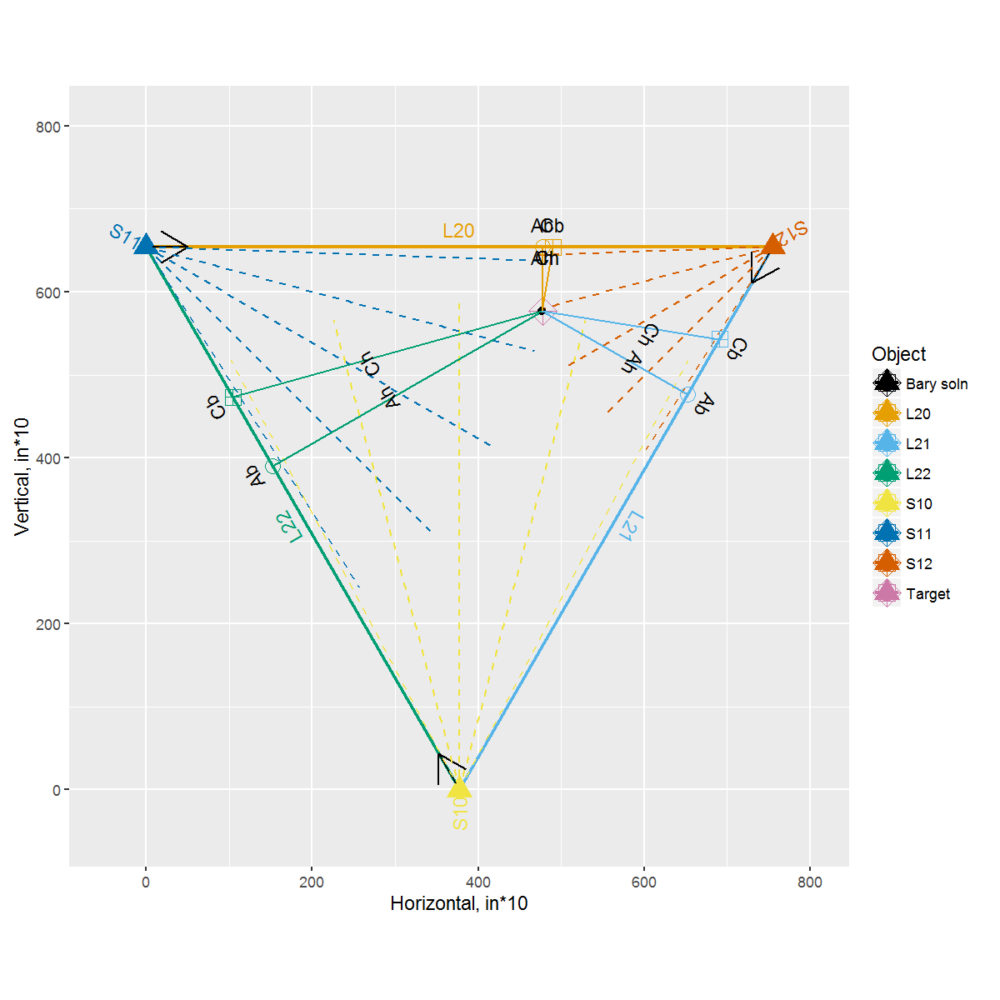

# "Shadows"

## Introduction

Briefly, the lighting will be addressable APA102s defining the perimeter of a equilateral triangle with ~7' edges.  The lighting at each edge of the triangle is controlled by an ATMega328 uC (i.e. Moteuino) The location of an object penetrating the plane of the triangle will be known to each edge uC.  That is, when a human sticks their arm inside the plane and waves it around, that location information is updated real-time.

## Code Layout

* datasheets/ contains the relevant hardware data sheets for complex devices.
* gateway/  contains the Windows/MacOS wireless programming tools, which allows you to program the light and sensor nodes over-the-air (OTA).
* libraries/ contains the relevant Arduino IDE libraries, and includes custom, shared libraries (Shadows_*) shared by both light and sensor nodes.  
* tests/ unit tests.
* src/ primary location for gateway, lighting and sensor code.
	* Gateway_Programmer/ code base for device that serves as a gateway for WirelessProgramming tool.
	* Node_Location/ code base for device attached to ultrasound range finders.
	* Node_Lights/ code base for device attached to LED lighting.

## Physical Layout

Each of the vertices (10, 11, 12: Node_Location) have ultrasound range-finders.  These nodes range in a Round-Robin sequence (to prevent interference by each other).  The sensor readings take ~10 ms, and the distance information is transmitted in ~5 ms.  

Each of the edges (20, 21, 22: Node_Lights) translate the broadcasted positional information to a animation of LEDs on the edges.

## Notation

The code base is written to avoid floating point operations, choosing to use fixed point mathematics instead.  Distance measurements are supplied as centainches (10 centainches = 1 inch), which is an order-of-magnitude more accurate than the range finders' specification.  Thus, the last digit of any calculated value likely contains noise.

### Altitude Notation

The location of the object in the plane in altitude notation is specified (Ab, Ah).  The object's position is given as perpendicular to the side edge and LED strips.  Ab is "altitude base", and is the centainch displacement of the object from the origin of the side.  Ah is "altitude height", and is the centainch displacements of the object from Ab.  Thus, altitude notation expresses the object as a vertex of a right tringle with the sides and LED strips.

Altitude notation (Ah, in particular) provides trilinear coordinates for the object, which can be converted into barycentric coordinates.  This has a number of strong advantages: these coordinate transforms allow triginometric calculations (read: floating point) to be replaced by algebraic calculations (read: fixed point).  Specifically, the code base used here uses only fixed point squared (X^2) and square root (X^(1/2)) calculations, and positional information is produced in less than 1 ms after receipt.  

### Collinear Notation

The location of the object is the plane in collinear notation is specified (Cb, Ch).  The object's position is given as collinear to the side length and LEDs and the vertex opposide the side length and LEDs.  Cb is "collinear base", and is the centainch diplacement of the cevian intercepting the side length.  Ch is "collinear height", and is the centainch displacement of the diplacement of the object from Cb.  Thus, collinear notation expresses the object as collinear projection on the sides and LED strips.

When an object is above the midpoint of a side and LED strips, collinear and altitude expressions for the object location are equivalent.  When the object is to one side or the other of the center, collinear notation leads to more rapid changes in side length and LED strip displacement.  

### Area Notation

Altitude notation can be quickly transformed into trilinear and barycentric coordinates for the object.  This leads to quick computation of the relative area of the triangles formed from the side lengths and LEDs and the object.  

## Installation and Getting Started

1. Install github tools.
2. Download source.
3. Install Arduino IDE.
    1. Open Arduino IDE
    2. Setting File->Preferences->Sketchbook Location to the location of installed source.  
    3. Setting Show Verbose Compilations.
    4. Restart Arudino IDE.
4. Compile changes to relevant code (Node_Lights, Node_Location).  Note .hex location.
5. Connect Gateway_Programmer/ Moteuino.  Note COM port.
6. Open gateway/WirelessProgramming tool.  Set COM port and .hex location from above.
    1. Set target nodeID (20, 21, 22: Node_Lights; 10, 11, 12: Node_Location), upload.  Repeat to the other two nodes.
